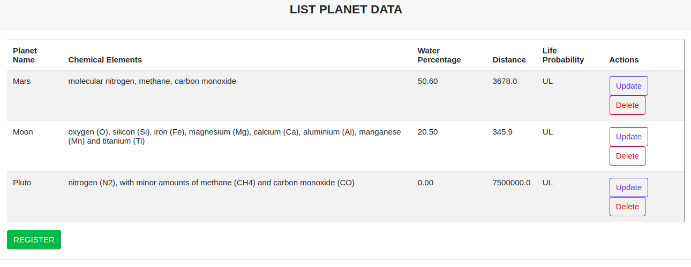
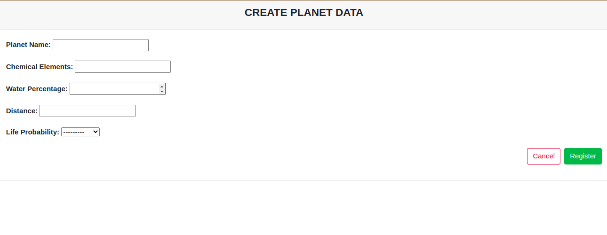
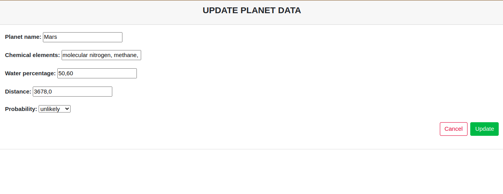

# izanami
CRUD system of another galaxy to get, create, update and remove planet data.

<i>Izanami Django Aplication</i>

<hr>
<p align="center">
  <a href="#desafio">About</a>&nbsp;&nbsp;&nbsp;|&nbsp;&nbsp;&nbsp;
  <a href="#tecnologias">Technologies</a>&nbsp;&nbsp;&nbsp;|&nbsp;&nbsp;&nbsp;
  <a href="#instalacao">How to Execute</a>&nbsp;&nbsp;&nbsp;|&nbsp;&nbsp;&nbsp;  
  <a href="#imagens">Some Images</a>&nbsp;&nbsp;&nbsp;|&nbsp;&nbsp;&nbsp; 
  <a href="#links_apps">Usefull Links</a>&nbsp;&nbsp;&nbsp;|&nbsp;&nbsp;&nbsp;
</p>
<hr>

## <a id="desafio"> 💻 ABOUT THE PROJECT </a><br>

- Create a new register of a planet data, giving: planet name, chemical elements present on the planet, water percentage, distance from earth, probability of having life.


> 🟩  Status do projeto: FINISHED <br>
<hr>
  
  ## <a id="tecnologias"> 🧪 TECHNOLOGIES </a>

- Front-End:


-Back-End:


- Personal Enviroment:


<hr>

## <a id="instalacao"> 🔴 STEP BY STEP ON HOW TO EXECUTE THE APPLICATION </a> 

* Windows:

<b>-Clone the repo:</b> `https://github.com/renatamoon/izanami.git` <br>
<b>-Create the environment:</b> `python -m venv venv`<br>
<b>-Activating the virtual environment: </b>`. venv\Scripts\Activate.ps1`<br>
<b>Obs: Any error on the activation:</b> in the powershell comandline type: `Set-ExecutionPolicy -Scope CurrentUser -ExecutionPolicy RemoteSigned`<br>
<b>-Execute the requirements: </b>`pip install -r requirements.txt`<br>

*Linux:

<b>-Clone the repo<br>
<b>-Create the environment:</b> `virtualenv venv`<br>
<b>-Activating the virtual environment:</b> `. venv/bin/activate`<br>
<b>-Execute the requirements:</b> `pip install -r requirements.txt`<br>
  
 <hr> 
  
* Any changes on the database, please set on the archive <b>`settings.py`</b>. In this case I'm using the default sqlite database.<br>

```
DATABASES = {
    'default': {
        'ENGINE': 'django.db.backends.mysql',
        'HOST': 'host_bd',
        'PORT': 'porta_bd',
        'NAME': 'desafio_2',
        'USER': 'usuario_bd',
        'PASSWORD': 'senha_bd'    
    }
}
```

- Migrate: `python manage.py migrate` <br>
- Execute the server: `python manage.py runserver` <br>
  
<hr>

## <a id="imagens"> 🔴 IMAGES: </a> 

Initial Page: <br>
<br>
- List of Planet Informaition:
<br>
<br>

<br>
<br>
- Creating a new planet data:
<br>

<br>
<br>
- Updating the already existant planet data:
<br>

<br>
<hr>
  
## <a id="links_apps"> 🔴 LINKS ÚTEIS </a> 

* CHALENGE LINK: https://gitlab.com/orenanft/django-project-to-copy.